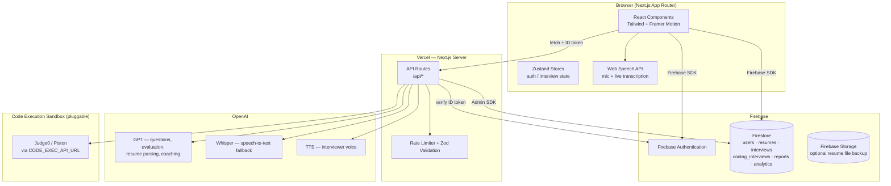

# Architecture

## System overview

## Request flow: a text interview answer

1. Client submits an answer to `POST /api/answers/evaluate` with a Firebase ID token.
2. The route verifies the token via `firebase/admin.ts`, applies rate limiting, and validates the body with Zod.
3. `services/evaluationService.ts` calls GPT with a structured prompt and parses a strict JSON response.
4. The route also asks GPT whether a natural follow-up question is warranted.
5. The client receives `{ evaluation, followUp }`, updates the interview document in Firestore directly (owner-scoped by security rules), and advances to the next question.
6. On the last question, `POST /api/reports/generate` produces the final `InterviewReport` and marks the interview `completed`.

## Why the split between client Firestore writes and server Firestore writes

- **Client-writable** (behind security rules): `interviews` (the signed-in user's own documents) — keeps the interview flow fast and simple.
- **Server-only** (Admin SDK, rules deny client writes): `resumes` (parsed by the resume-parse route), `reports` (generated after evaluation), `analytics` (aggregated), `users.xp/level/achievements` (gamification state) — prevents client-side tampering with scores, XP, and parsed data.

## Data model

See `types/index.ts` for the full TypeScript definitions. Top-level Firestore collections:

| Collection | Written by | Purpose |
|---|---|---|
| `users` | client (profile fields) / server (xp, level, achievements) | Account + gamification state |
| `resumes` | server | Parsed resume: skills, projects, experience |
| `interviews` | client | Questions, answers, evaluations, embedded report |
| `coding_interviews` | client (submission) / server (review) | Coding challenge submissions + AI review |
| `reports` | server | Denormalized copy of each interview's final report |
| `analytics` | server | Aggregated per-user performance snapshot for the Analytics page |
| `achievements` | server (seed script) | Read-only badge catalog |
